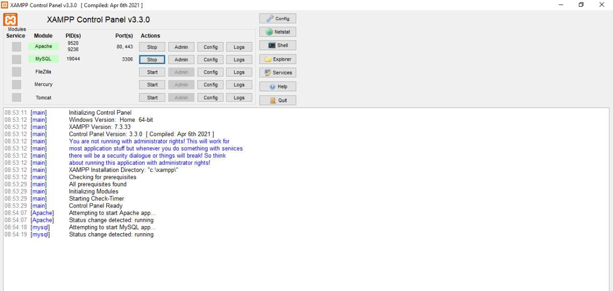
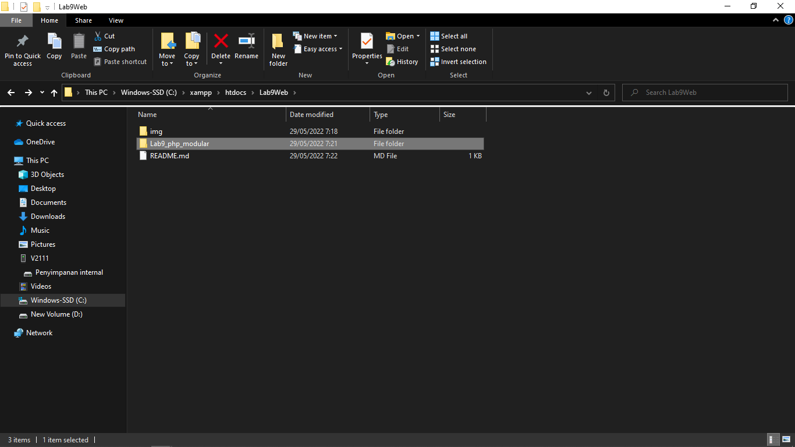
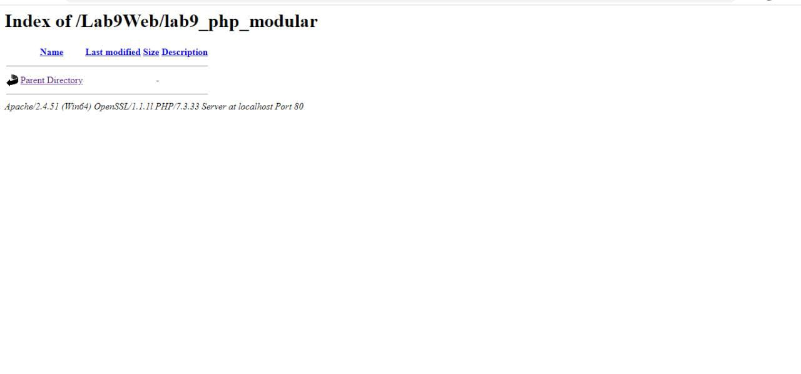
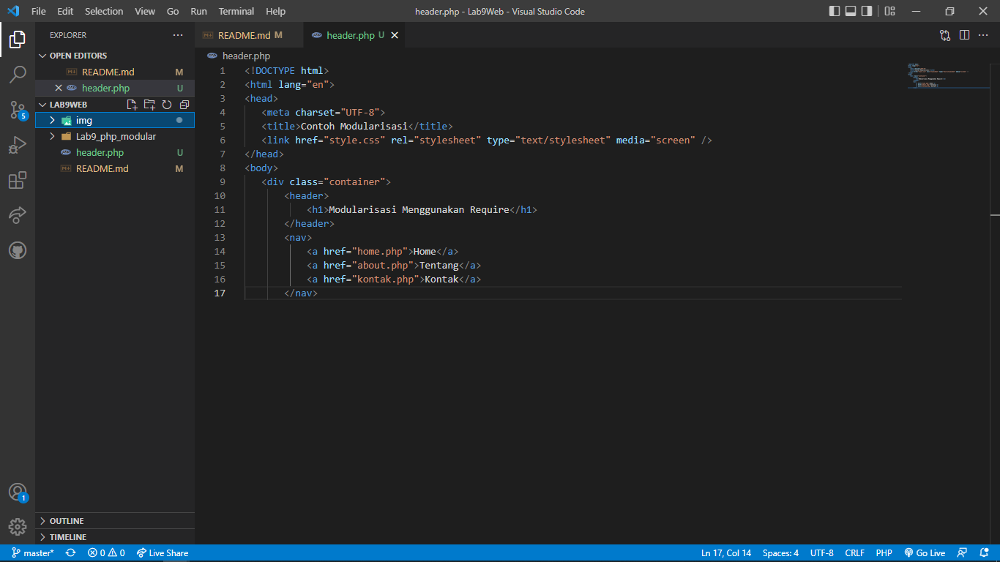
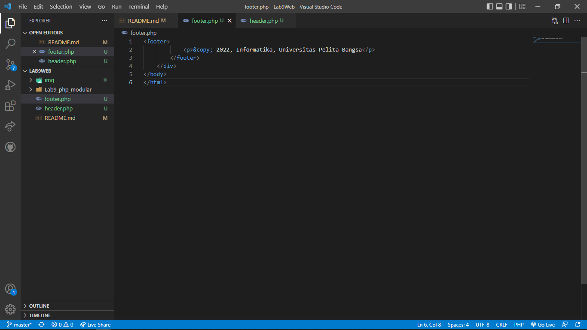
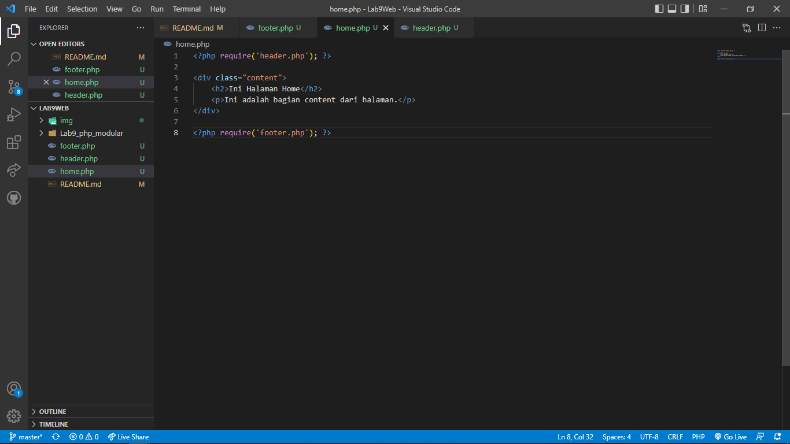
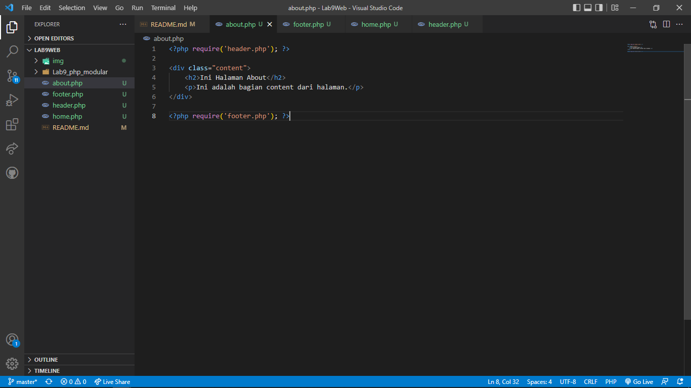
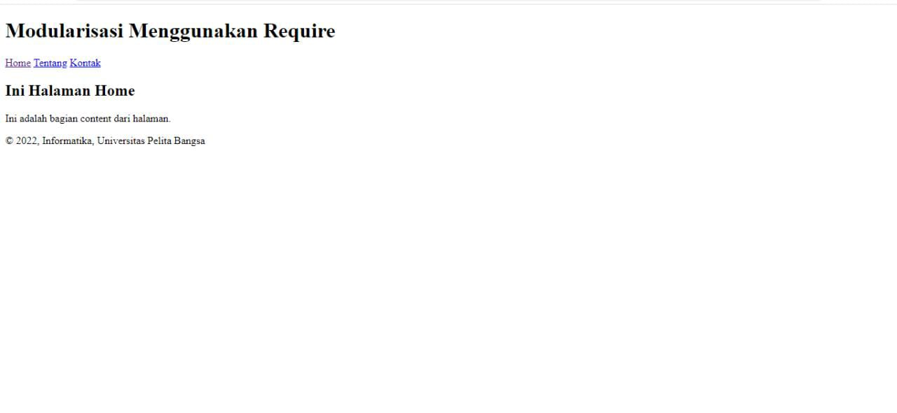
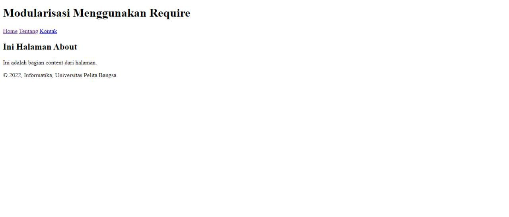

| DEVI SILMA YUNIAR | 312010458 |
|-------------------|-----------|
|    Praktikum 8    |  Pert-11  |

## dipertemuan kali ini saya akan mempelajari php mudular
 
## LANGKAH-LANGKAH PRAKTIKUM
-----------------------------------------
## 1. MENJALANKAN XAMPP

Menjalankan xampp server localhost

## 2. Membuat polder baru dengan nama Lab9_php_modular

Kemudian jalankan pada localhost server 

## 3. Membuat folder baru dengan nama header.php

Buat header seperti contoh diatas

code header

<!DOCTYPE html>
<html lang="en">
<head>
   <meta charset="UTF-8">
   <title>Contoh Modularisasi</title>
   <link href="style.css" rel="stylesheet" type="text/stylesheet" media="screen" />
</head>
<body>
   

       <header>
           <h1>Modularisasi Menggunakan Require</h1>
       </header>
       <nav>
           <a href="home.php">Home</a>
           <a href="about.php">Tentang</a>
           <a href="kontak.php">Kontak</a>
       </nav>

## Membuat file baru dengan nama footer.php

buat footer.php dan code nya

code footer

<footer>
            
&copy; 2022, Informatika, Universitas Pelita Bangsa

        </footer>
    

</body>
</html>

## 5. Membuat file baru dengan nama home.php

buat home.php beserta code nya

code home

<?php require('header.php'); ?>

    <h2>Ini Halaman Home</h2>
    
Ini adalah bagian content dari halaman.

<?php require('footer.php'); ?>

## 6. buat file baru dengan nama about.php

buat about.php beserta code nya

code about

<?php require('header.php'); ?>

    <h2>Ini Halaman About</h2>
    
Ini adalah bagian content dari halaman.

<?php require('footer.php'); ?>

## Tampilkan di browser

## - tampilan home page pada browser yang menggunakan modular header dan footer

## - tampilan about page pada browser yang menggunakan modular header dan footer

## PERTANYAAN DAN TUGAS 

## - Implementasikan konsep modularisasi pada kode program praktikum 8 tentang database, sehingga setiap halamannya template tampilan yang sama. 

## 1. membuat folder baru lab9_tugas

penjelasan

Buat file baru atau salin file pada praktikum 8 lalu implementasikan dengan menambahkan modular header dan footer

HASIL 

